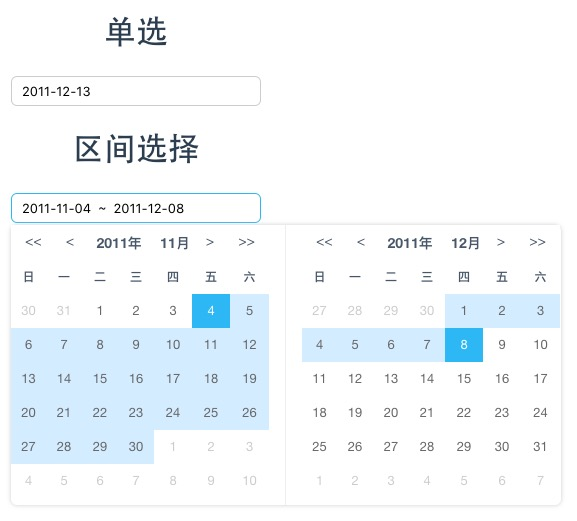

# vue-dateSelector

> vue-dateSelector for vue2.0

# demo

  The demo page is [HERE](https://ws456999.github.io/vue-dateSelector/).
  


# Installation

## npm

```shell
$ npm install --save vue-date-selector
```


## Usage

```javaScript
import DateSelector from 'vue-date-selector'

components: {
  DateSelector
}
```

```html
<!--datePicker-->
<date-selector :date-default="time" :is-range=false></date-selector>

<!--dateRangePicker-->
<date-selector :date-default="time" :is-range=true></date-selector>

```
## props

````
dateDefault: { type: Array, default: [] }, // need a Array like: ['2016-11-11'] or ['2016-11-11', '2016-11-22'],

isRange: { type: Boolean, default: false }, // isrange option

width: { type: String, default: '250px' },  // inputWidth

placeholder: {type: String, default: ''},

readonly: { type: Boolean, default: true },

format: { type: String, default: 'YYYY-MM-DD' },   // dateFormat

name: { type: String, default: '' },

myclick: { type: Function }, // Callback

````